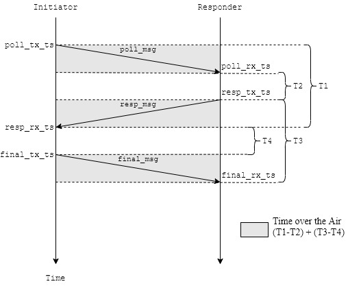

# Double Sized - Two Way Ranging 

This example consist of two programs: a initiator and a responder.

## Initiator

This application sends a "poll" frame (recording the TX time-stamp of the poll), and then waits for a "response" message expected from the **responder**. When the response is received its RX time-stamp is recorded and we send a "final" message to complete the exchange. The final message contains all the time-stamps recorded by this application, including the calculated/predicted TX time-stamp for the final message itself. The companion "DS TWR responder" example application works out the time-of-flight over-the-air and, thus, the estimated distance between the two devices.

## Responder

This application waits for a "poll" message (recording the RX time-stamp of the poll) expected from the **initiatior** , and then sends a "response" message recording its TX time-stamp, after which it waits for a "final" message from the **initiator** to complete the exchange. The final message contains the remote initiator's time-stamps of poll TX, response RX and final TX. With this data and the local time-stamps, (of poll RX, response TX and final RX), this example application works out a value for the time-of-flight over-the-air and, thus, the estimated distance between the two devices, which it writes to console.
## How does it works

### TWR - Two Way Ranging

As depicted in the Figure below, each side of communication register the timestamp of transmission and reception of each message. In the `final_msg`, the **initiator** puts on the payload the timestamps `poll_tx_ts`, `resp_rx_ts` and `final_tx_ts` to the **responder**.

When **responder** receives the `final_msg` it calculates the total time over the air. 



The message "navigates" on the air in the gray shadow area. Then, the total Time over ther air is calculated by the formula `(T1-T2) + (T3-T4)`. And if divide this by 4 gets the time average the message take to go from one node to other.

So, the average time formula is:
$$
Avg_{time} = \frac{(T1-T2) + (T3-T4)}{4}\\
$$

Where:
```
T1 = (resp_rx_ts - poll_tx_ts)
T2 = (resp_tx_ts - poll_rx_ts)
T3 = (final_rx_ts - resp_tx_ts)
T4 = (final_tx_ts - resp_rx_ts)
```

Another formula to calculate the same average time is:

$$
Avg_{time} = \frac{(T1 \times T3 - T4 \times T2)} {(T1+T2+T3+T4)}
$$

