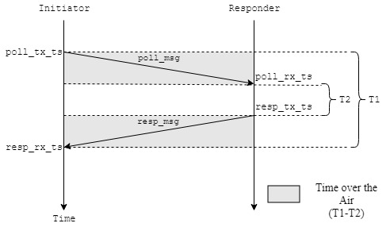

# Single Sized - Two Way Ranging 

This example consist of two programs: a initiator and a responder.

## Initiator

This application sends a "poll" frame (recording the TX time-stamp of the poll), and then waits for a "response" message expected from the **responder**. When the response is received its RX time-stamp is recorded. The response message contains the remote time-stamps of poll RX and response TX. With this data and the local time-stamps, (of poll TX and response RX and final RX), this example application works out a value for the time-of-flight over-the-air and, thus, the estimated distance between the two devices, which it writes to console.

The companion "SS TWR responder" example application works out the time-of-flight over-the-air and, thus, the estimated distance between the two devices.

## Responder

This application waits for a "poll" message (recording the RX time-stamp of the poll) expected from the **initiatior**, and then sends back a "response" with time-stamps embedded: RX time-stamp of the poll, and the TX time-stamp of the response. With this information the **initiator** is able to calculate the distance. 
## How does it works

### TWR - Two Way Ranging

As depicted in the Figure below, each side of communication register the timestamp of transmission and reception of each message. .

When **initiator** receives the `resp_msg` it calculates the total time over the air. 



The message "navigates" on the air in the gray shadow area. Then, the total Time over ther air is calculated by the formula `(T1-T2)`. And if divide this by 2 gets the time average the message take to go from one node to other.

So, the average time formula is:
$$
Avg_{time} = \frac{(T1-T2)}{2}\\
$$

Where:
```
T1 = (resp_rx_ts - poll_tx_ts)
T2 = (resp_tx_ts - poll_rx_ts)
```

